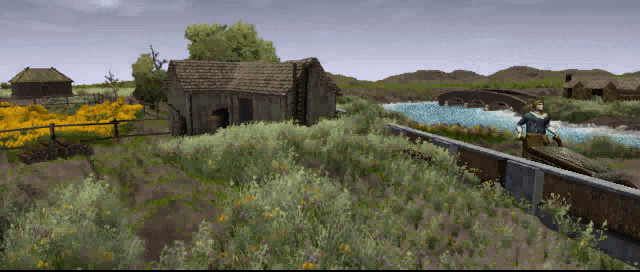
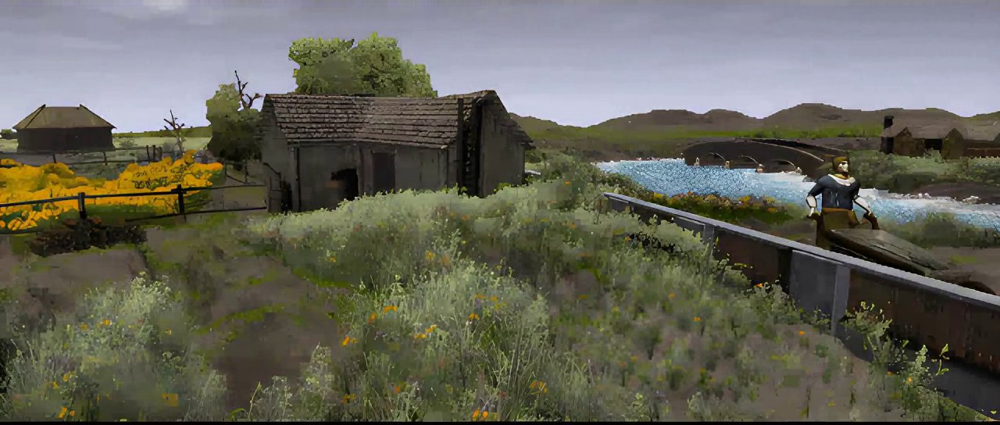

<h1>Correction de la traduction de Baldur's Gate : Enhanced Edition et Baldur's Gate : Siege of Dragonspear</h1>

<h3>Un mod développé sur <a href="https://www.baldursgateworld.fr">La Couronne de Cuivre</a> pour BG:EE (v2.6+), BG:SoD (v2.6+) et EET (v13+)<h3>

 

**Auteurs :** <a href="https://www.baldursgateworld.fr/memberlist.php?mode=viewprofile&u=10748">Lefreut</a> et <a href="https://www.baldursgateworld.fr/memberlist.php?mode=viewprofile&u=12991">Jazira</a>

**Forum du mod :** <a href="https://www.baldursgateworld.fr/viewforum.php?f=756">Correction de la traduction de Baldur's Gate : Enhanced Edition et Baldur's Gate : Siege of Dragonspear</a>

 

<a href="#intro">Présentation</a> &#8226; <a href="#compat">Compatibilité</a> &#8226; <a href="#components">Composants</a> &#8226; <!--<a href="#images">Captures d'écran et vidéos</a> &#8226;--> <a href="#credits">Crédits et remerciements</a> &#8226; <a href="#versions">Historique des versions</a> 

## Présentation

Ce mod a pour objectif de corriger la traduction française de Baldur's Gate : Enhanced Edition et de Baldur's Gate : Siege of Dragonspear, ainsi que de proposer une version française complète digne de ce nom, aussi bien au niveau des textes que du doublage audio.

En effet, le <a href="https://forums.beamdog.com/discussion/81909/patch-2-6-launches-today" target="_blank">patch 2.6</a> de BG:SoD sorti en avril 2021, propose une nouvelle traduction française officielle réalisée par le prestataire de <a href="https://www.beamdog.com/" target="_blank">Beamdog</a> : <a href="https://mogi-group.com/" target="_blank">Mogi Group</a>. Désespérément attendu depuis mars 2016 par la communauté française, ce nouveau patch traduit notamment le contenu de Baldur's Gate : Siege of Dragonspear.

Bien que cette nouvelle traduction officielle ouvre de nouvelles perspectives, elle comporte également certaines régressions majeures, comparée à ses prédécesseures. Comme par exemple : l'absence totale de doublage audio en français (<a href="#doublage">par exemple la comparaison du doublage BG:SoD/CorrectfrBG1EE //todo</a>) ou encore de dialogue accordé au féminin pour le personnage joueur (<a href="#images">par exemple la réponse 4 //todo</a>), qui étaient pourtant bien présents dans le jeu original.

Par ailleurs, de nombreux choix pris dans BG:SoD ne sont pas compatibles avec le travail effectué par les traducteurs et relecteurs francophones bénévoles depuis maintenant plus de 20 ans. Comme par exemple : le vouvoiement systématique (<a href="#images">par exemple Imoen qui vouvoie le personnage joueur, ou l'inverse //todo</a>), ou encore des changements de noms propres (<a href="#images2">par exemple « Château Paldragon » qui devient « Château Vougedragon » //todo</a>), pour ne citer qu'eux.

Nous constatons donc que la fidélité et la qualité de cette nouvelle traduction officielle ne correspondent pas aux attentes de la communauté.

La traduction de BG:EE, quant à elle, souffre encore de quelques doublages audio en français manquants (<a href="#doublage">par exemple la comparaison du doublage BG:EE/BG1/CorrectfrBG1EE //todo</a>), qui étaient pourtant bien présents dans le jeu original, ou encore de quelques fautes.

Notre objectif est d'être aussi fidèle que possible aux textes originaux, sans pour autant être obstinément fermé à certaines propositions de cette nouvelle traduction officielle, afin d'en tirer le meilleur parti. De plus, de nombreuses corrections et améliorations supplémentaires ont été intégrées aux textes et aux doublages originaux de BG:EE, voir la section <a href="#components">Composants</a> pour plus de détails.

Toute suggestion pour améliorer ce mod, ainsi que tout bénévole souhaitant apporter sa pierre à l'édifice, sont plus que bienvenus. Ce mod se veut être communautaire, n'hésitez pas à vous impliquer !

Merci de nous signaler toute éventuelle faute à corriger sur le <a href="https://www.baldursgateworld.fr/viewforum.php?f=756" target="_blank">Forum du mod</a>.

<a href="#top">Retour en haut de page</a>

## Installation

#### Jeux concernés

Le mod « Correction de la traduction de Baldur's Gate : Enhanced Edition et Baldur's Gate : Siege of Dragonspear » est conçu pour fonctionner sur BG:EE (v2.6+), BG:SoD (v2.6+) et EET (v13+).

#### Compatibilité avec les autres mods

« Correction de la traduction de Baldur's Gate : Enhanced Edition et Baldur's Gate : Siege of Dragonspear » est un mod WeiDU et devrait par conséquent être compatible avec n'importe quel mod WeiDU. Si vous rencontrez des bugs, veuillez contacter <a href="https://www.baldursgateworld.fr/memberlist.php?mode=viewprofile&u=10748">Lefreut</a> ou <a href="https://www.baldursgateworld.fr/memberlist.php?mode=viewprofile&u=12991">Jazira</a>, ou encore poster dans le <a href="https://www.baldursgateworld.fr/viewforum.php?f=756">Forum du mod</a>.

#### Ordre d'installation

Veuillez installer « Correction de la traduction de Baldur's Gate : Enhanced Edition et Baldur's Gate : Siege of Dragonspear » avant tout autre mod, notamment Enhanced Edition Trilogy (EET).

#### Installer un mod WeiDU

L'installation du correctfrBGEE est simple. Il suffit de décompresser le contenu de l'archive dans le répertoire où le jeu est installé, d'exécuter setup-correctfrbgee.exe et de suivre les instructions. Pour plus de détails, voir <a href="https://www.baldursgateworld.fr/viewtopic.php?t=12614">cette FAQ</a> ou consulter le readme dans l'archive (readme/readme-correctfrbgee.html).

#### Language du doublage vidéo et audio

« Correction de la traduction de Baldur's Gate : Enhanced Edition et Baldur's Gate : Siege of Dragonspear » vous offre 2 options au sujet du doublage vidéo et audio :

- __VF+VO__ ; Doublage français corrigé, doublage anglais par défaut du contenu Enhanced Edition conservé :
	- Nécessite le composant __[20] Patch audio français.__

- __VF__ ; Doublage français corrigé uniquement, bruitage du contenu Enhanced Edition conservé :
	- Nécessite les composants __[20] Patch audio français__ + __[30] Suppression des doublages en anglais.__

<a href="#top">Retour en haut de page</a>

## Composants

Le programme d'installation comprend les composants suivants. Chacun possède un numéro distinct et pré-défini qui lui attribue une position déterminée ; ce qui permet aux autres composants et aux autres mods de le détecter et aux utilitaires d'installation automatique de préciser quels composants installer.

##

#### [10] Correction de la traduction de Baldur's Gate : Enhanced Edition et Baldur's Gate : Siege of Dragonspear

Ce composant apporte toutes les corrections nécessaires aux textes de BG:EE et BG:SoD.

- Importation des correctifs des textes du <a href="https://github.com/Gibberlings3/EE_Fixpack">EEfixpack</a>.
- Ajout des versions féminines manquantes et suppression des versions féminines inadéquates.
- Ajout des onomatopées, actions et interjections dans les « sous-titres » des répliques doublées pour les malentendants (Aïe !, Hmmmm..., \*soupire\*, etc.).
- Ajout des détails omis de la version originale.
- Correction des « sous-titres » pour les répliques doublées en français.
- Correction des tutoiements/vouvoiements.
- Correction et uniformisation des noms propres (personnages, lieux, organisations, lore, objets, sorts, etc.).
- Correction et uniformisation des onomatopées, actions et interjections (\*sanglote\*, \*rester silencieux\*, \*rote\*, etc.).
- Correction des non-sens et des erreurs de traduction.
- Correction des caractères spéciaux (æ, ō, œ, Œ, Î, Ù, Ê, É, È, À, Ç, Ô, etc.).
- Correction des fautes de frappe, d'orthographe, de conjugaison et de grammaire.
- Uniformisation du cartouche des objets et des sorts.
- Uniformisation de la casse et de la ponctuation (?, !, :, ;, «, », ', -, etc.).
- Uniformisation des textes partagés entre BG:EE et BG2:EE (objets, sorts, interface utilisateur, etc.).
- Suppression des whitespaces et des caractères spéciaux inadéquats.
- Amélioration de la « qualité de vie » (espaces insécables, 10 000, 2 365, etc.).
- Réduction du nombre de majuscules dans les noms communs (Tante, Elfe Noir, le Très Noble Ordre des Chevaliers du Cœur Radieux, etc.).
- Réduction des anglicismes (ok, hello, ranger, yeah, etc.).
- Réduction des mots-clés inutiles ou inadéquats (\<GABBER\>, \<HESHE\>, \<GIRLBOY\>, etc.).
- Correction (et/ou ajout) de références de ligne des objets (noms, infobulles, descriptions, icônes, etc.) :
	

Cliquez ici pour afficher les corrections.

	<pre>
	- Cotte de mailles elfe noir +3 (DWCHAN01.ITM).
	- Cotte de mailles elfe noir +5 (DWCHAN02.ITM).
	- Cimeterre elfe noir +3 (DWSW1H01.ITM).
	- Épée longue elfe noir +3 (DWSW1H02.ITM).
	- Fléau d'armes elfe noir +3 (DWBLUN01.ITM).
	- Lance elfe noir +3 (DWSPER01.ITM).
	- Arbalète de vitesse elfe noir +3 (DWXBOW01.ITM).
	- Bouclier elfe noir +3 (DWSHLD01.ITM).
	- Carreau de sommeil elfe noir +1 (DWBOLT01.ITM).
	- Carreau d'étourdissement elfe noir +1 (DWBOLT02.ITM).
	- Carreau elfe noir +1 (DWBOLT03.ITM).
	- Armure de plates complète elfe noir +3 (DWPLAT01.ITM).
	- Fléchette de sommeil elfe noir +1 (DWDART01.ITM).
	</pre>
	

- Correction (et/ou ajout) de références de ligne des créatures (noms, infobulles, etc.) :
	

Cliquez ici pour afficher les corrections.

	<pre>
	- Aventurière (bdbfor13.CRE).
	- Archère croisée (bdccarc1.CRE, bdcru01d.CRE, bdcruaf5.CRE, bdcruml4.CRE, bdcruml9.CRE, bdcrus90.CRE, bdcrus96.CRE, BDGUAR56.CRE).
	- Croisée (bdccsol1.CRE, bdcru05d.CRE, bdcru41.CRE, bdcruml2.CRE, BDCRUS23.CRE, BDCRUS24.CRE, bdcrus34.CRE, bdcrus39.CRE, bdcrus49.CRE, bdcrus51.CRE, bdcrus52.CRE, bdcrus54.CRE, bdcrus73.CRE, bdcrus74.CRE, bdcrus75.CRE, bdcrus76.CRE, bdcrus79.CRE, bdcrus91.CRE, bdcruz03.CRE, bddsarc3.CRE, bdforcw4.CRE, bdwave52.CRE, bdwave54.CRE).
	- Défenseuse de Fort-du-Pont (bdbfind2.CRE, bdbfor16.CRE).
	- Magicienne croisée (bdccmag1.CRE, bdcru123.CRE, bdcru56.CRE, bdcru58.CRE, bdcrubbm.CRE, bdcrumf7.CRE, bdcrus92.CRE, bdcruw47.CRE, bdcruw49.CRE, bdwave23.CRE, bdwave26.CRE, bdwave28.CRE).
	- Garde croisée (BDCAGE1.CRE, bddssen1.CRE, bddssen6.CRE, bddssen7.CRE, bdguar22.CRE, bdguar23.CRE).
	- Prêtresse croisée (bdcccle1.CRE, bdcru107.CRE, bdcru121.CRE, bdcru51.CRE, bdcru53.CRE, bdcruc44.CRE, bdcruc45.CRE, bdcruc49.CRE, bdcruml6.CRE, bdwave34.CRE).
	- Milicienne de Gué-de-la-Dague (bdcoa02d.CRE, bddagf36.CRE, bddagf40.CRE, bddagf41.CRE, bddagf42.CRE, bddagf43.CRE, bddagf44.CRE, bddagf45.CRE, bddagf46.CRE, bddagf47.CRE, bddagf49.CRE, bddagf61.CRE, bddagf70.CRE, bddagf71.CRE).
	- Croisée d'élite (bdcruc41.CRE, bdcrue30.CRE, bdcrue33.CRE, bdcrue41.CRE, bdcrue44.CRE, bdcrue51.CRE, bdcrue53.CRE, bdcrus7d.CRE, BDCRUS9D.CRE, bdcruw42.CRE, bdlieutd.CRE).
	- Patrouilleuse croisée (bdcrus81.CRE, bdcrus82.CRE, bdcrus83.CRE, bdsahgd2.CRE).
	- Gardienne du culte (bdcult25.CRE).
	- Magicienne du culte (bdcult27.CRE).
	- Prêtresse naine (bddcler2.CRE, bdteam51.CRE).
	- Magicienne sombre (bddm04.CRE, bddm05.CRE, bddm08.CRE).
	- Voleuse de l'ombre (bdfinal2.CRE, bdfinal5.CRE).
	- Éclaireuse du Poing Enflammé (bdfist25.CRE).
	- Magicienne du Poing Enflammé (bdfistm1.CRE).
	- Assassine (bdgass1.CRE).
	- Soldate infectée (bdinfec2.CRE, BDINFEC4.CRE, BDINFEC6.CRE).
	- Officière croisée (bdccoff1.CRE).
	- Sergente croisée (bdccsar1.CRE, bdcru49.CRE, bdcrux31.CRE, bdcrux34.CRE, bdcrux41.CRE, bdcrval.CRE, bdforcw2.CRE, bdguar2x.CRE).
	- Soldate du Poing Enflammé (BDFFGIRL.CRE, BDFFXXII.CRE, bdfistce.CRE, bdfistcf.CRE, BDFISTCL.CRE).
	- Caporale du Poing Enflammé (bdfist20.CRE).
	- Vétérane du Poing Enflammé (bdfist42.CRE).
	- Sergente du Poing Enflammé (bdfscou2.CRE).
	- Prisonnière (BDPRIS02.CRE).
	- Lieutenante de Caelar (bdlieutb.CRE).
	- Gredine (BDMUGG2.CRE).
	- Réfugiée (bdrefc1.CRE, bdrefc2.CRE, bdrefc3.CRE, bdrefc4.CRE, bdrefc5.CRE, bdreffc1.CRE, bdrefg1.CRE, bdrefg2.CRE, BDREFGF1.CRE, BDREFGF2.CRE, BDREFGF3.CRE, BDREFGF4.CRE, BDREFGF5.CRE, BDREFGF6.CRE, BDREFGF7.CRE, bdrefx1.CRE, bdrefx10.CRE, bdrefx2.CRE, bdrefx3.CRE, bdrefx4.CRE, bdrefx5.CRE, bdrefx6.CRE, bdrefx7.CRE, bdrefx8.CRE, bdrefx9.CRE, BDSITRE4.CRE, BDURE6A.CRE, BDURE7B.CRE).
	- Archère de la coalition (bdteam12.CRE).
	- Conscrit croisé (bdcchob2.CRE, bdcckob1.CRE, bdccrec2.CRE, bdccrec3.CRE, bdcru02d.CRE, bdcru44.CRE, bdcruml5.CRE, bdcrumlb.CRE, bdcrur26.CRE, bdcrur27.CRE, BDCRUR29.CRE, bdcrur30.CRE, bdcrur32.CRE, bdcrur40.CRE, bdcrur42.CRE, bdcrus98.CRE, bdkher1.CRE).
	- Pourfendeuse de magiciens (bdteam23.CRE).
	- Magicienne de bataille de la coalition (bdteam41.CRE, bdteam43.CRE).
	- Malfaitrice (BDURE10B.CRE).
	- Magicienne de bataille aquafondaise (bdwarma1.CRE, bdwtr61.CRE).
	- Cavalière croisée (bdwave33.CRE).
	- Soldate aquafondaise (bdwtr37.CRE, bdwtr39.CRE, bdwtr40.CRE, bdwtr41.CRE, bdwtr42.CRE, bdwtr43.CRE, bdwtr44.CRE, bdwtr45.CRE, bdwtr46.CRE, bdwtr48a.CRE, bdwtr48b.CRE, bdwtr49.CRE, bdwtr58a.CRE, bdwtr82.CRE, bdwtr92.CRE, bdwtr93.CRE, bdwtr94.CRE).
	- Messagère (bdwtr47.CRE).
	- Sergente aquafondaise (bdwtrx36.CRE).
	- Roturier (BDBLOCK.CRE).
	- Roturière (bdfan02.CRE).
	- « Dame » Alyth Elendara (ALYTH.CRE, BDALYTH.CRE).
	- Battuks Dourotteur (bdbattuk.CRE).
	- Raggemos Braillefantôme (bdraggem.CRE).
	- Sab'n Crachebave (bdsabn.CRE).
	- Sickly T'matta (bdsickly.CRE).
	- Voleuse des Lames de la Nuit (BPAMBT1.CRE).
	- Patronne de la taverne (BPTAVE01.CRE).
	- Assassine du culte (CULTT3.CRE, CULTT3A.CRE).
	- Archère du culte (CULTT4.CRE).
	- Chevaleresse spectrale (KNIGHT2.CRE, KNIGHT5.CRE).
	- Initiée de la Lune Noire (RSDINITM.CRE).
	- Lieutenante de la Lune Noire (RSDMNK04.CRE).
	- Moniale de la Lune Noire (RSDMNK02.CRE, RSDMNK05.CRE, RSDMNK08.CRE, RSDMNKB.CRE).
	- Habitante des égouts (SEWERF5.CRE).
	- Alu-fiélonne (TELALU1.CRE).
	- Roublarde (THIEFF.CRE).
	- Narcillicus Harwilliger Néen (NARCIL.CRE).
	- Thalantyr le Conjurateur (THALAN.CRE).
	</pre>
	

##

#### [20] Patch audio français

Ce composant ajoute des doublages en français.

- Inclusion des répliques doublées en français de BG1 manquantes.
- Importation des ensembles de voix doublées en français de BG2 pour le personnage principal.
- Correction (et/ou ajout) des répliques doublées de BG:EE importées de BG1 :
	

Cliquez ici pour afficher les corrections.

	<pre>
	- [AJANT33], [AJANT38], [AJANT39], [ALDET08], [ALDET09], [ALORA38], [ALORA39], [AMNSO05], [AMNSO06], [ANGEL03], [ANGEL04], [ARDEN03], [ARDEN04], [AVALH03], [AVALH04], [BANDT05], [BANDT06], [BARTN05], [BARTN06], [BASSL03], [BASSL04], [BEGGR05], [BEGGR06], [BELAN03], [BELAN04], [BELTT08], [BELTT09], [BENTL03], [BENTL04], [BLACK03], [BLACK04], [BRAGE02], [BRAGE03], [BRAGE04], [BRANW38], [BRANW39], [BRELK03], [BRIEL03], [BRIEL04], [BRUNN03], [BRUNN04], [BRUNS04], [CADER08], [CADER09], [CALDO03], [CALDO04], [CASSN03], [CASSN04], [CATTC03], [CATTC04], [CENTL02], [CENTL03], [CENTL04], [CHANT06], [CHANT07], [CHAPTER1], [CHAPTER3], [CORAN03], [CORAN38], [CORAN39], [DAVEO04], [DAVEO08], [DAVEO09], [DELOR03], [DELOR04], [DELSV03], [DELSV04], [DOPPL02], [DOPPL08], [DOPPL09], [DRIZT08], [DRIZT09], [DROTH03], [DROTH04], [DRUID05], [DRUID06], [DRUNK05], [DRUNK06], [DRYAA03], [DRYAA04], [DRYAD08], [DRYAD09], [DUNKN03], [DUNKN04], [DWARF05], [DWARF06], [DYNAH38], [DYNAH39], [EDWIN38], [EDWIN39], [ELDOT38], [ELDOT39], [ELFFF05], [ELFFF06], [ELMIN08], [ELMIN09], [ELTAN08], [ELTAN09], [EMERS03], [EMERS04], [ENTAR04], [FALDN03], [FALDN22], [FALDN38], [FALDN39], [FARME05], [FARME06], [FCHIL02], [FCHIL05], [FCHIL06], [FESTH05], [FESTH06], [FLAMN05], [FLAMN06], [FTOWN05], [FTOWN06], [GALKN03], [GALKN04], [GAMES05], [GAMES06], [GANDL03], [GANDL04], [GANTL01], [GANTL03], [GANTL04], [GARRK38], [GARRK39], [GATEW03], [GATEW04], [GDOPP08], [GDOPP9], [GELLN03], [GELLN04], [GHOUL03], [GHOUL04], [GHOUL08], [GHOUL09], [GLANM03], [GLANM04], [GNARL03], [GNARL04], [GNOLL01], [GNOLL02], [GNOLL08], [GNOLL09], [GNOME05], [GNOME06], [GONDP05], [GONDP06], [GONDS03], [GONDS04], [GORIN08], [GORIN09], [GREYW08], [GREYW09], [GUARR01], [GUARR05], [GUARR06], [GUIDE03], [GUIDE04], [HAIRT03], [HAIRT04], [HALFL05], [HALFL06], [HELMP05], [HELMP06], [HELSH03], [HELSH04], [HOBGL08], [HOBGL09], [HOGRE02], [HOGRE08], [HOGRE09], [HUSAM05], [HUSAM09], [IMOEN12], [IMOEN13], [INNKE05], [INNKE06], [IRLEN03], [IRLEN04], [ITHMR03], [ITHMR04], [JAHER38], [JAHER39], [JEBAD03], [JEBAD04], [JHASS03], [JHASS04], [KAGAN04], [KAGAN38], [KAGAN39], [KEEPR03], [KEEPR04], [KESTR03], [KESTR04], [KHALD38], [KHALD39], [KIVAN03], [KIVAN20], [KIVAN38], [KIVAN39], [KOBLD01], [KOBLD02], [KOBLD03], [KOBLD04], [KOBLD08], [KOBLD09], [KORAX08], [KORAX09], [KRUMM01], [KRUMM02], [KRUMM03], [KRUMM04], [KRYST07], [KRYST08], [KRYST09], [LIIAJ08], [LIIAJ09], [LOTHR03], [LOTHR04], [MALKL03], [MALKL04], [MAREK03], [MAREK04], [MARLL03], [MARLL04], [MCHIL05], [MCHIL06], [MENDA_05], [MENDA_06], [MERCH05], [MERCH06], [MESSN04], [MESSN05], [MINER05], [MINER06], [MINSC38], [MINSC39], [MONKS05], [MONKS06], [MONTR38], [MONTR39], [MTOWN05], [MTOWN06], [MULAH04], [MULAH05], [MULAH08], [MULAH09], [MYSTR03], [MYSTR04], [NALIN03], [NALIN04], [NARLN03], [NARLN04], [NERED05], [NERED06], [NERED07], [NERED08], [NERED09], [NIKLS03], [NIKLS04], [NIMBL08], [NIMBL09], [NOBLW05], [NOBLW06], [NOBW203], [NOBW204], [NTHUG03], [NTHUG04], [NYMPH01], [NYMPH08], [NYMPH09], [OGHMA05], [OGHMA06], [OGREE02], [OGREE08], [OGREE09], [OGREM01], [OGREM03], [OGREM08], [OGREM09], [OGRIL08], [OGRIL09], [OUBLK03], [OUBLK04], [PERFO05], [PERFO06], [PNOBL10], [PNOBL11], [POISN04], [POISN05], [PRISM03], [PRISM04], [RAGEF03], [RAGEF04], [RAIKN03], [RAIKN04], [RAMAZ03], [RAMAZ04], [READR05], [READR06], [REDEG03], [REDEG04], [RESAR03], [RESAR04], [REVEN08], [REVEN09], [RIELT03], [RIELT04], [SAFAN38], [SAFAN39], [SAREV08], [SAREV09], [SCARR08], [SCARR09], [SENIY03], [SENIY04], [SHAEL_04], [SHAEL_05], [SHAEL_06], [SHAEL_07], [SHAEL_09], [SHART38], [SHART39], [SHOAL03], [SHOAL04], [SILEN03], [SILEN04], [SILKE03], [SILKE04], [SILLL03], [SILLL04], [SIRIN03], [SIRIN04], [SIRIN05], [SIRIN06], [SIRIN08], [SIRIN09], [SKELW01], [SKELW02], [SKELW04], [SKELW09], [SKIEE38], [SKIEE39], [SLAVE01], [SLAVE05], [SLAVE06], [SLYTH08], [SLYTH09], [SONNR03], [SONNR04], [SORCR04], [SORCR05], [STORE05], [STORE06], [SURGN03], [SURGN04], [SWENC05], [SWENC06], [TAERM03], [TAERM04], [TAMOK08], [TAMOK09], [TAURG03], [TAURG04], [TELMN03], [TELMN04], [TENYA03], [TENYA04], [TETHT03], [TETHT04], [TEVEN03], [TEVEN04], [THALD03], [THALD04], [THALT03], [THALT04], [TIAXX38], [TIAXX39], [TOGRE04], [TOGRE05], [TOLAN_05], [TOLAN_06], [TOWNC03], [TOWNC04], [TRACE_05], [TRACE_06], [TREMN03], [TREMN04], [TUTHH03], [TUTHH04], [ULRAN03], [ULRAN04], [UMBER05], [UMBER06], [VARCI03], [VARCI04], [VICON38], [VICON39], [VILFA05], [VILFA06], [VILLF05], [VILLF06], [VILLM05], [VILLM06], [VOLOO08], [VOLOO09], [WARRI05], [WARRI06], [WENCH03], [WENCH04], [WILTN03], [WILTN04], [WKNIG04], [WKNIG05], [XANNN38], [XANNN39], [XVART03], [XVART08], [XVART09], [XZARR38], [XZARR39], [YESLK38], [YESLK39], [ZOMBI01], [ZOMBI02], [ZOMBI03], [ZOMBI04], [ZOMBI09].
	</pre>
	

- Ajout (et/ou correction) des répliques doublées de BG:SoD importées de BG2 :
	

Cliquez ici pour afficher les corrections.

	<pre>
	- [1amerc03], [1amerc04], [drpris01], [drpris02], [drpris03], [drpris04], [drsol101], [drsol102], [drsol103], [drsol104], [drsol105], [drsol106], [drsol107], [garren01], [garren03], [garren04], [garren05], [ggmal01], [ggmal02], [ggmal03], [ggmal04], [gprif01], [gprif02], [gprif03], [gprif04], [gprif05], [gprif06], [gprif07], [gprim01], [gprim02], [gprim03], [gprim04], [gprim05], [gprim06], [gprim07], [human01], [human02], [human03], [human04], [human05], [human06], [human07], [human08], [human09], [hvillf01], [hvillf02], [hvillf03], [hvillf05], [hvillf06], [hvillm08], [JAHEIRG2], [JAHEIRG3], [JAHEIRG4], [JAHEIRG5], [LEOPA05], [malsal01], [malsal02], [malsal03], [malsal05], [malsal06], [nobfe201], [nobfe202], [nobfe207], [nobfe208], [nobfe209], [peasf01], [peasf02], [peasf03], [peasf04], [ruffia01], [ruffia02], [ruffia03], [ruffia04], [ruffia05], [ruffia06], [ruffia07], [ruffia08], [solf01], [solf02], [solf03], [solf04], [solf05], [solf06], [solf07], [solm01], [solm02], [solm03], [solm04], [solm05], [solm06], [solm07], [sthfe01], [sthfe02], [sthfe04], [sthfe05], [sthfe06], [sthfe07], [sthfe08], [termin01], [termin04], [termin05], [termin17], [unearf01], [unearf02], [unearf03], [unearf04], [unearf05], [unearf08], [VAMPM01], [VAMPM02], [VAMPM03], [VAMPM04], [VAMPM05], [VAMPM06], [VAMPM07], [VAMPM09].
	</pre>
	

- Correction (et/ou ajout) des ensembles de voix :
	

Cliquez ici pour afficher les corrections.

	<pre>
	- [bdtptol], [Female9a], [Female9b], [Female9c], [Female9d], [Female9e], [Female9f], [Female9g], [Female9h], [Female9i], [Female9j], [Female9k], [Female9l], [Female9m], [Male9a], [Male9b], [Male9c], [Male9d], [Male9e], [Male9f], [Male9g], [Male9h], [Male9i], [Male9j], [Male9k], [Male9l], [Male9m].
	</pre>
	

- Les répliques non doublées en français sont conservées.

##

#### [30] Suppression des doublages en anglais (nécessite le composant "Patch audio français")

Ce composant supprime les doublages anglais restants.

- Suppression des répliques non doublées en français.
- Les doublages de type « bruitages » du contenu BG:SoD sont conservés.

##

#### [40] Suppression des ensembles de voix en anglais

Ce composant supprime les ensembles de voix en anglais.

- Suppression des ensembles de voix en anglais de BG:EE et BG:SoD.
- Suppression des ensembles de voix en anglais de Adventurers of Neverwinter pour le personnage principal ajoutées par le patch 2.6.

##

#### [50] Restauration des cinematiques classiques

Ce composant restaure les cinematiques classiques de la version orignale de Baldur's Gate.

- Inclusion des vidéos doublées en français de BG.
- Réduction des artefacts de compression et augmentation de la résolution des cinématiques.

<a href="#top">Retour en haut de page</a>

## Captures d'écran et vidéos

##

#### Cinématiques

Comparez les différentes versions des cinématiques (BG/BG:EE/CorrectfrBG1EE).

#### BG2

#### CorrectfrBG2EE

<a href="#top">Retour en haut de page</a>

## Crédits et remerciements

#### Auteurs : <a href="https://www.baldursgateworld.fr/memberlist.php?mode=viewprofile&u=10748">Lefreut</a> et <a href="https://www.baldursgateworld.fr/memberlist.php?mode=viewprofile&u=12991">Clément « Jazira » Bizieau</a>

##

#### Remerciements particuliers à :

- Nos contributeurs, relecteurs, bêta-testeurs, etc. :
	- Maud « Elisabeth » Fanny
	- Tiffany « GrootIsntTree » Goalec
	- Leilu
	- Johnbob
	- Selphira
	- Rivvers
	- Krabator
- L'équipe des précédents bénévoles traducteurs et relecteurs français de BG:EE :
	- Lionel « La Voix 2 la sagesse » Bayle-Denise
	- Denis « Isaya » Ribayrol
	- Cédric « Armancia » Bakari
	- Damien « Zefhyr » Costaz
	- David « Graoumf » Pascaud
	- Rodolphe « Medillen » Gilliot
	- Silvin « Aerynn » Leroy
	- Eric « oldschool » Van Honacker
	- Isabelle « Lothringen » Coumert
	- Alvaro « Kukaracha » Lamarche-Toloza
	- Marie-Violaine « Calawen » Polonowski
	- Dovakhiin 
	- Kerozevok
	- Taikobo
	- Trez
	- Mornagest
	- Zefklop
	- Freddy_Gwendo
- Freddy_Gwendo pour son modèle de <a href="https://github.com/GwendolyneFreddy/LCC-Readme">readme</a>.
- L'équipe de <a href="https://www.baldursgateworld.fr">La Couronne de Cuivre</a> pour l'hébergement de ce mod.
- Les créateurs de la série Baldur's Gate : <a href="https://www.bioware.com/">Bioware</a> et <a href="https://www.obsidian.net/">Black Isle Studios</a>, ainsi que <a href="https://www.aroundtheword.com/fr/">Around the word</a> pour la traduction française du contenu classique.
- Les créateurs des Enhanced Editions et de Siege of Dragonspear : <a href="https://www.beamdog.com/">Overhaul Games</a>, <a href="https://www.beamdog.com/">Beamdog</a>, ainsi que <a href="https://mogi-group.com/">Mogi Group</a> pour la traduction française de Siege of Dragonspear.
- L'équipe des d'Oghmatiques pour leurs nombreuses traductions, ainsi qu'à tous les bénévoles moddeurs, traducteurs, relecteurs de la communauté française.
- Merci à toutes les personnes des forums de <a href="https://www.baldursgateworld.fr">La Couronne de Cuivre</a>, <a href="https://www.gibberlings3.net/forums/">The Gibberlings Three</a>, <a href="http://www.shsforums.net/">Spellhold Studios</a>, et des autres communautés de joueurs et de moddeurs IE.

##

#### Logiciels et outils utilisés pour la réalisation de ce mod :

- <a href="https://github.com/WeiDUorg/weidu/releases">WeiDU</a> de Wes Weimer, the bigg et Wisp.
- <a href="https://github.com/Argent77/NearInfinity/releases">Near Infinity</a> de Jon Olav Hauglid, FredSRichardson et Argent77.
- <a href="https://www.gimp.org/">GIMP</a> par l'équipe de the GIMP.
- <a href="http://notepad-plus-plus.org/">Notepad++</a> par l'équipe de Notepad++, Don Ho.
- <a href="https://github.com/">GitHub</a> par l'équipe de GitHub.
- <a href="https://tortoisegit.org/">TortoiseGit</a> par l'équipe de TortoiseGit.
- <a href="https://www.audacityteam.org/">Audacity</a> par l'équipe d'Audacity.

##

#### Information sur les droits d'auteur

###### Le mod « Correction de la traduction de Baldur's Gate : Enhanced Edition et Baldur's Gate : Siege of Dragonspear » n'est pas développé, supporté ni approuvé par BioWare&trade; ou Interplay/Black Isle, Overhaul Games, Beamdog ou Wizards of the Coast. Il a été développé par Lefreut et Jazira, et est basé sur les jeux Baldur's Gate : Enhanced Edition et Baldur's Gate : Siege of Dragonspear.
###### Tout le contenu du mod appartient à &copy; Lefreut et Jazira.
###### Baldur's Gate et Baldur's Gate : Tales of the Sword Coast à &copy; TSR, Inc. Baldur's Gate : Siege of Dragonspear à &copy; Beamdog, Inc. Le moteur Infinity Engine appartient à &copy; BioWare Corp. Toutes les autres marques et droits d'auteur appartiennent à leurs propriétaires respectifs.

###### Ce mod a été créé pour être librement apprécié par tous les joueurs de Baldur's Gate : Enhanced Edition et Baldur's Gate : Siege of Dragonspear. Cependant, il ne doit pas être vendu, publié, compilé ou redistribué sous une forme quelconque sans le consentement de ses auteurs.
###### Veuillez noter que tout partage ou hébergement de ce mod est interdit sans la permission des auteurs.

###### S'il existe des problèmes de droits d'auteur ou si cette déclaration nécessite une révision, veuillez nous contacter et nous conseiller sur la démarche à suivre. Plus particulièrement, si vous trouvez dans ce mod des illustrations susceptibles d'être en conflit avec les règles de droits d'auteur, merci de bien vouloir nous le faire savoir dès que possible et nous supprimerons immédiatement le contenu en question.

######  Ce module (y compris l'intégralité du code et de la documentation) est déposé sous la licence <a href="https://creativecommons.org/licenses/by-sa/3.0/deed.en_US">Creative Commons Attribution-ShareAlike 3.0 Unported License</a>. Vous êtes libre de partager (copier, distribuer, transmettre) et de modifier (adapter) ce travail, à des fins non commerciales. Pour plus de précisions, veuillez consulter la <a href="https://creativecommons.org/licenses/by-nc/3.0/legalcode">Creative Commons Public License</a>.
###### Tous les copyrights et marques commerciales appartiennent à leurs propriétaires respectifs.

##

La communauté de modding sur le moteur Infinity Engine a été très active depuis plus de vingt ans maintenant, et a produit des milliers d'heures de travail non rémunérées effectuées par des fans du jeu. Les moddeurs, traducteurs et relecteurs s'efforcent de publier le meilleur de leur travail, et les joueurs bénéficient des mods les plus performants et les mieux maintenus, à condition que nous travaillions tous vers un même but.

Mais cette harmonie peut malheureusement être perturbée, principalement par deux comportements. Le premier, c'est de revendiquer le travail de quelqu'un d'autre. Le second consiste à héberger et à redistribuer un mod sans la permission de son(es) auteur(s).

Soyez assez sympas avec vos collègues joueurs, moddeurs, traducteurs et relecteurs. Ne le faites pas.

<a href="#top">Retour en haut de page</a>

## Historique des versions

#### Version 0.8 &nbsp;(4 octobre 2023)

  - Corrections pour les sons utilisés dans des cutscene du composant Suppression des doublages en anglais.
  - Uniformisation BGEE et BG2EE.
  - Corrections diverses.

#### Version 0.7 &nbsp;(8 juillet 2023)

  - Relecture et corrections des sorts.
  - Correction des répliques doublées.
  - Correction de fichiers audio.
  - Uniformisation BGEE et BG2EE.

#### Version 0.6 &nbsp;(2 avril 2023)

  - Relecture et corrections des sorts.
  - Correction des répliques doublées.
  - Correction de fichiers audio.
  - Uniformisation BGEE et BG2EE.
  - Uniformisation des espaces insécables.

#### Version 0.5 &nbsp;(19 février 2023)

  - Correction des répliques doublées.
  - Correction de fichiers audio.
  - Uniformisation BGEE et BG2EE.
  - Corrections diverses.

#### Version 0.4 &nbsp;(22 décembre 2022)

  - Correctifs créatures (féminisation / masculinisation, correction, uniformisation).
  - Affichage du nom des ensembles de voix en français.
  - Ajout des ensembles de voix BG2.
  - Séparation de la modification Suppression des ensembles de voix en anglais dans son propre composant.
  - Corrections diverses.

#### Version 0.3 &nbsp;(12 novembre 2022)

  - Uniformisation BGEE et BG2EE.
  - Corrections diverses.

#### Version 0.2.1 &nbsp;(10 octobre 2022)

  - Correction installation BGEE sans SoD.

#### Version 0.2 &nbsp;(9 octobre 2022)

  - Nouveau composant Patch audio francais.
  - Nouveau composant Suppression des doublages en anglais.
  - Uniformisation BGEE et BG2EE.
  - Corrections diverses.

#### Version 0.1 &nbsp;(14 août 2022)

  - Version prototype.

<a href="#top">Retour en haut de page</a>

